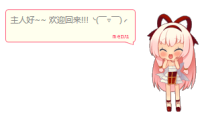

### Purpose
我的博客小插件

### Function
* 隐藏插件
* 增加图灵api
* 随机讲故事或笑话
* 移动端适配


### Example
我的博客1: http://www.cnblogs.com/lt1726/

我的博客2: http://lutao1726.gitee.io/



### Use-Method
参照index.html中的调用方法即可
``` html
<!DOCTYPE html>
<html lang="en">

<head>
    <meta charset="UTF-8">
    <title>Demo</title>
</head>

<body>
    <script type="text/javascript" src="lib/jquery.js"></script>
    <script type="text/javascript" src="dist/chuncai.js"></script>
    <script type="text/javascript">
        $.chuncai();
    </script>
</body>

</html>
```
### Issue
* 目前用的是我的账号，图灵api调用次数只有1000次/每天，有兴趣的可以改为自己的账号,位置在app.js中
``` js
    tuling: {
            key: "xxxxxxxxxxxxxxxxxxxxxxxxxxxxxxx",
            userid: "xxxxx"
    },
```
修改成自己的账号后，重新打包即可

### Package
    * 安装node.js
    * 安装webpack
    * webpack --config webpack.config.js 即可

